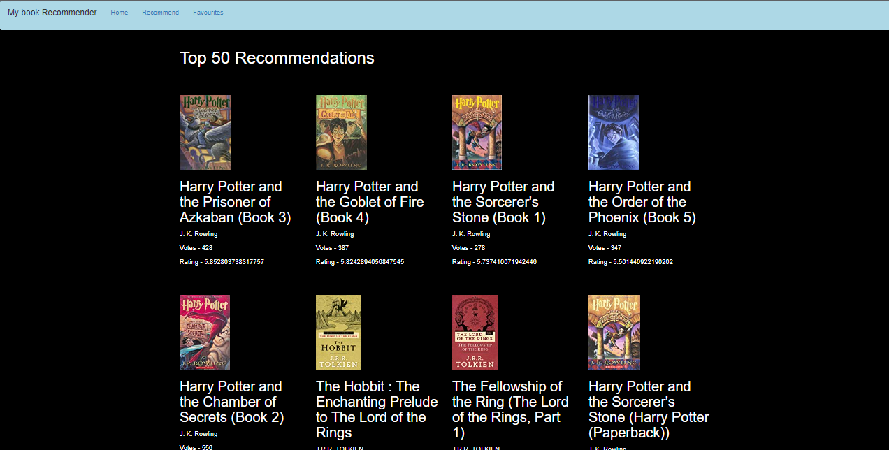
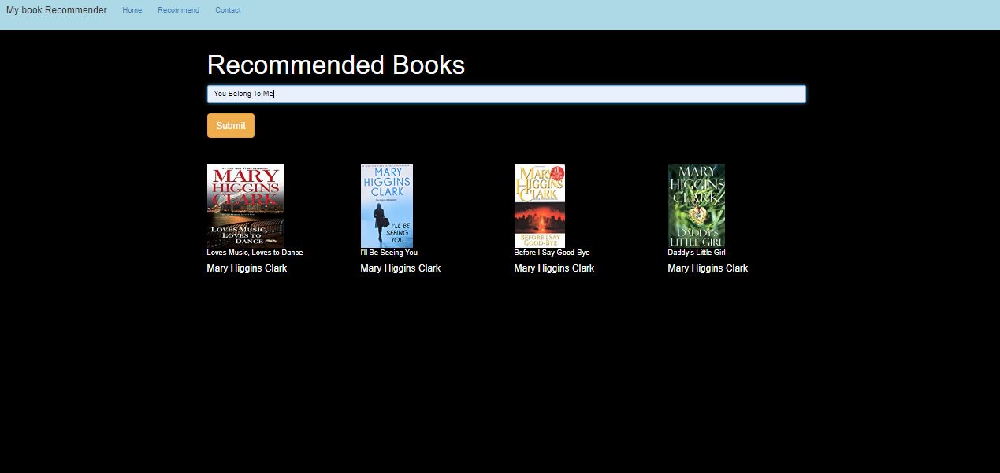
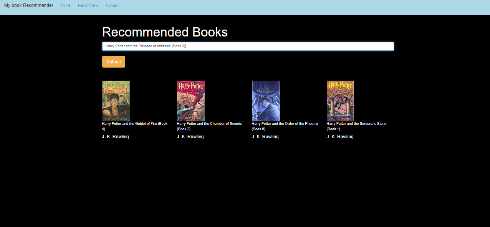

## Books Recommendation System

The end-to-end Book Reccomendation system based on User-based Collaborative Filtering which makes the personalized recommendation for users with similar preferences.

Q. Types of Collaborative filtering?
1. User-based, which measures the similarity between target users and other users. 
2. Item-based, it measures the similarity between the items that target users rate or interact with and other items.

Idea is very simple, items that you might like based on tastes/reactions of similar users. (eg. I like things which my friends like because me and my friends are similar)

## Screenshots
	# Popularity based 
	

	
	
	# Collaborative based
	

	

 
## About Project
	Books review dataset which is used to create recommender system is from kaggle Book Recommendation dataset (https://www.kaggle.com/datasets/arashnic/book-recommendation-dataset). 
	Then the data is preprocessed i.e Duplicate data is removed and null data is truncated and kept the essential features which are used to create our model.

	In Popularity based system, our recommendation system displays top 50 books which has the highest average ratings. Apparently, we have only used those books which has more than
	200 ratings. Then we calculates average ratings of all the filtered books and sort them in descending order and displays the top 50 books.
	
	In Collaborative based system, we have created a similarity matrix that tells the correlation between every book with each other. And based on the users input, we displays four books
	that have highest correlation with the user's choice.

## Link
	This project is deployed to Heroku.
	link - https://books-recommender-system-py.herokuapp.com/
